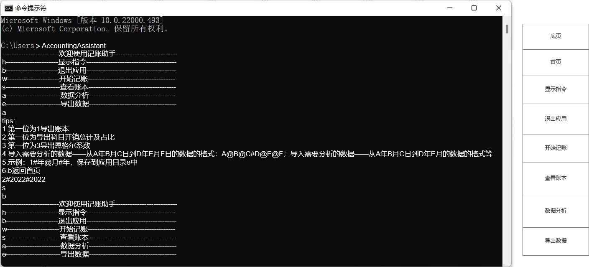

# 记账助手需求文档

版本号：1.0

记账助手使用C开发，采用收付实现制及单式记账，目前是一款本地记账程序。

## 记账内容

1. 只记支出，不记收入
2. 记账科目包括：学习、餐饮、餐饮外生活、零食、其他
3. 记账内容包括：发生时间、发生金额（人民币）、发生科目、具体内容及备注、记账时间
4. 禁止使用英文符号“,”及空格“ ”

## 记账科目解释

1. 学习：记录包括但不限于购买学习用书籍或课程、购买辅助学习的工具（例如文具、耳机）等基于学习有意义的知识而产生的开销的科目。
2. 餐饮：记录因一日三餐及额外加餐产生的开销的科目。
3. 餐饮外生活：记录除餐饮开销外的用于维持个人生命存续的开支（例如：宿舍水电费）的科目。
4. 零食：记录非用于维持个人生命存续，基于个人偏好而产生的食品购买开支的科目。
5. 其他：记录除以上科目外的一切开支的科目。

#### 科目代码

学习：1；餐饮：2；餐饮外生活：3；零食：4；其他：5

## 具体内容及备注要求

至少记录到名称、规格及数量，不做强制要求，亦无格式审查。

例如，一笔零食开支的具体内容及备注可以是“108g乐事薯片2包”；一笔餐饮开销的具体内容及备注可以“早餐：一瓶豆浆、一根油条、一个鸡蛋；午餐：铁板烧茄子蛋包饭外卖一份”。

## 存储形式

1. 存储格式：“发生时间 发生金额 发生科目 具体内容及备注 记账时间 行数 是否存续”。
2. 物理存储：创建“年/月/日”三层目录，在“日”目录下创建以“年\_月\_日”为命名格式的txt文本。

## 关于导出

1. 该版本可以导出从A年B月C日到D年E月F日的数据。
2. 该版本可以导出包括但不限于科目开销总计及占比、恩格尔系数的分析数据。
2. 下一个版本或可以支持导出历史发展趋势的分析数据。
2. 该版本不支持修改导出路径，导出路径为：应用目录/e。

## 功能流程图

## 产品原型图

首页的HTML文件存放到[./记账助手原型图/HTML/首页.html](.\记账助手原型图\HTML\首页.html)

##  架构

该版本采用三层架构，分为view、service、dao层。

###  view

